#  Hi there, I'm **Brhane**!

<div align="center">
  
  

</div>

---

## 🚀 About Me


🎯 **Senior Software Engineer** with expertise in **Enterprise Applications** & **AI Solutions**  
🎓 **Computer Science & Engineering** Graduate from **Mekelle Institute of Technology**  
💡 Passionate about building **scalable systems** and **intelligent applications**  
🌟 **5+ Years** of experience delivering **high-impact solutions**  
🔥 Specialized in **Microservices Architecture** and **Machine Learning Integration**

### 🎪 What I Do Best:
- 🏗️ **Enterprise Backend Development** with Spring Boot & Microservices
- 🎨 **Modern Frontend Applications** using Vue.js & React
- 📱 **Cross-Platform Mobile Apps** with Flutter
- 🤖 **AI/ML Solutions** & LLM Integration
- 📊 **Database Architecture** & Performance Optimization
- 🔄 **Agile Development** & DevOps Practices

---

## ⚡ Core Technologies

<div align="center">

### 🔥 **Backend Mastery**


### 🎨 **Frontend Excellence**


### 📱 **Mobile Development**


### 🤖 **AI & Machine Learning**


### 🗄️ **Database Systems**


### 🎨 **UI/UX & Styling**


### 🧪 **Testing & Quality**


</div>

---

## 🏆 Professional Highlights

<div align="center">
  
| 🎯 **Expertise Areas** | 🚀 **Achievements** |
|:--:|:--:|
| **Enterprise Applications** | 50+ Production Systems |
| **Microservices Architecture** | 99.9% Uptime Record |
| **AI/ML Integration** | 10+ Intelligent Solutions |
| **Mobile Development** | Cross-Platform Excellence |
| **Database Optimization** | 300% Performance Gains |
| **Agile Leadership** | Team Productivity Champion |

</div>

---

## 💻 Professional Skills Matrix

<div align="center">

### 🔥 **Backend Architecture & Development**
<table>
<tr>
<td align="center" width="25%">

<br><strong>Java</strong>
<br>████████████ 98%
</td>
<td align="center" width="25%">

<br><strong>Spring Boot</strong>
<br>█████████████ 95%
</td>
<td align="center" width="25%">

<br><strong>Laravel</strong>
<br>███████████ 90%
</td>
<td align="center" width="25%">

<br><strong>GraphQL</strong>
<br>██████████ 85%
</td>
</tr>
</table>

### 🎨 **Frontend & Mobile Development**
<table>
<tr>
<td align="center" width="25%">

<br><strong>Vue.js</strong>
<br>████████████ 92%
</td>
<td align="center" width="25%">

<br><strong>React</strong>
<br>██████████ 88%
</td>
<td align="center" width="25%">

<br><strong>Flutter</strong>
<br>████████████ 93%
</td>
<td align="center" width="25%">

<br><strong>TypeScript</strong>
<br>███████████ 90%
</td>
</tr>
</table>

### 🤖 **AI & Data Technologies**
<table>
<tr>
<td align="center" width="25%">

<br><strong>Python</strong>
<br>███████████ 87%
</td>
<td align="center" width="25%">

<br><strong>ML/AI</strong>
<br>██████████ 85%
</td>
<td align="center" width="25%">

<br><strong>LLM Integration</strong>
<br>████████████ 90%
</td>
<td align="center" width="25%">

<br><strong>Data Processing</strong>
<br>███████████ 88%
</td>
</tr>
</table>

### 🗄️ **Database & Infrastructure**
<table>
<tr>
<td align="center" width="25%">

<br><strong>MySQL</strong>
<br>████████████ 95%
</td>
<td align="center" width="25%">

<br><strong>PostgreSQL</strong>
<br>████████████ 92%
</td>
<td align="center" width="25%">

<br><strong>MongoDB</strong>
<br>██████████ 85%
</td>
<td align="center" width="25%">

<br><strong>DevOps</strong>
<br>███████████ 88%
</td>
</tr>
</table>

</div>

## 📊 Professional Portfolio

<div align="center">

### 🏆 **Achievement Highlights**

<table>
<tr>
<td align="center" width="25%">

<br><strong>Production Systems</strong>
</td>
<td align="center" width="25%">

<br><strong>Professional Development</strong>
</td>
<td align="center" width="25%">

<br><strong>System Reliability</strong>
</td>
<td align="center" width="25%">

<br><strong>Optimization Expert</strong>
</td>
</tr>
</table>

### 💼 **Development Activity**

```
📅 This Year:    ████████████████████████████████ 
🔥 Consistency:  ██████████████████████████████   
💻 Contributions:████████████████████████████████ 
🚀 Innovation:   ███████████████████████████████  
```

</div>

---

## 🌟 Featured Projects & Solutions

<div align="center">

### 🚀 **Enterprise & Microservices**
<table>
<tr>
<td align="center" width="50%">
<a href="#"></a>
<br><em>Scalable microservices architecture with Spring Boot backend and Vue.js frontend</em>
</td>
<td align="center" width="50%">
<a href="#"></a>
<br><em>Lightning-fast GraphQL APIs with optimized database queries</em>
</td>
</tr>
</table>

### 🤖 **AI & Machine Learning Solutions**  
<table>
<tr>
<td align="center" width="50%">
<a href="#"></a>
<br><em>Intelligent chatbot platform with advanced NLP capabilities</em>
</td>
<td align="center" width="50%">
<a href="#"></a>
<br><em>Machine learning analytics for business intelligence</em>
</td>
</tr>
</table>

### 📱 **Mobile & Web Applications**
<table>
<tr>
<td align="center" width="50%">
<a href="#"></a>
<br><em>Full-featured financial application with real-time transactions</em>
</td>
<td align="center" width="50%">
<a href="#"></a>
<br><em>Content management system with advanced user roles and permissions</em>
</td>
</tr>
</table>

</div>

---

## 🎯 Current Focus

```mermaid
graph LR
    A[🤖 AI Integration] --> B[🏗️ Microservices]
    B --> C[📱 Mobile Apps]
    C --> D[☁️ Cloud Solutions]
    D --> E[🚀 Innovation]
    E --> A
    
    style A fill:#00D9FF,stroke:#000,color:#000
    style B fill:#FF6B6B,stroke:#000,color:#000
    style C fill:#4ECDC4,stroke:#000,color:#000
    style D fill:#45B7D1,stroke:#000,color:#000
    style E fill:#96CEB4,stroke:#000,color:#000
```

<div align="center">



</div>

---

## 🤝 Let's Connect & Collaborate!

<div align="center">

### 💼 **Ready to build something amazing together?**

[](https://linkedin.com/in/brhane)
[](mailto:brhane.dev@gmail.com)
[](https://brhane.dev)
[](https://twitter.com/brhane_dev)

### 🚀 **Available for:**
- 💻 **Full-Stack Development Projects**
- 🤖 **AI/ML Consulting & Implementation**
- 📱 **Mobile App Development**
- 🏗️ **System Architecture Design**
- 👥 **Technical Leadership & Mentoring**

---

<div align="center">
  
</div>


