<div align="center">
  
</div>

<div align="center">
  
</div>

<div align="center">
  
</div>

<div align="center">

### 🚀 **My Development Journey & Contributions**

```
🎯 Software Engineering Excellence
████████████████████████████████████████████████████████ 2024: 159+ Commits
████████████████████████████████████████████████████████ 2023: 200+ Commits  
████████████████████████████████████████████████████████ 2022: 180+ Commits

☁️ Cloud Infrastructure Projects
████████████████████████████████████████████████ AWS Solutions: 25+ Projects
████████████████████████████████████████████████ Kubernetes: 15+ Deployments
████████████████████████████████████████████████ Docker: 40+ Containerized Apps

🤖 AI & Machine Learning Implementations
████████████████████████████████████████████████ LLM Integration: 12+ Projects
████████████████████████████████████████████████ ML Models: 8+ Production Systems
████████████████████████████████████████████████ AI APIs: 20+ Intelligent Services
```

</div>

<div align="center">
  <table>
    <tr>
      <td align="center" width="25%">
        
        <br><sub><b>Code Contributions</b></sub>
      </td>
      <td align="center" width="25%">
        
        <br><sub><b>Collaborative Development</b></sub>
      </td>
      <td align="center" width="25%">
        
        <br><sub><b>Quality Assurance</b></sub>
      </td>
      <td align="center" width="25%">
        
        <br><sub><b>Technology Mastery</b></sub>
      </td>
    </tr>
  </table>
</div>

<div align="center">
  
</div>

#  Welcome to My Digital Innovation Hub!

<div align="center">
  
</div>

## 🎯 About Me - Software & AI Engineer

```typescript
const brhaneHaftu: SoftwareEngineer = {
  name: "Brhane Haftu",
  title: "Senior Software & AI Engineer",
  specialization: "Cloud Architecture & Machine Learning",
  location: "🌍 Global Remote | Ethiopia",
  experience: "5+ Years Building Intelligent Systems",
  
  coreExpertise: {
    softwareEngineering: {
      backend: ["Java Spring Boot", "Laravel PHP", "Node.js", "Microservices"],
      frontend: ["Vue.js", "React", "TypeScript", "Progressive Web Apps"],
      mobile: ["Flutter", "React Native", "Cross-Platform Solutions"],
      architecture: ["Clean Architecture", "Domain-Driven Design", "SOLID Principles"]
    },
    
    artificialIntelligence: {
      machineLearning: ["TensorFlow", "PyTorch", "Scikit-learn", "Neural Networks"],
      llmIntegration: ["OpenAI GPT", "Anthropic Claude", "Custom AI Models"],
      nlp: ["Natural Language Processing", "Text Analytics", "Sentiment Analysis"],
      computerVision: ["Image Recognition", "Object Detection", "Deep Learning"]
    },
    
    cloudTechnologies: {
      platforms: ["AWS", "Google Cloud", "Azure", "Digital Ocean"],
      containerization: ["Docker", "Kubernetes", "Container Orchestration"],
      serverless: ["Lambda Functions", "Cloud Functions", "Serverless Architecture"],
      infrastructure: ["Terraform", "CloudFormation", "Infrastructure as Code"]
    },
    
    databases: {
      relational: ["PostgreSQL", "MySQL", "Advanced SQL Optimization"],
      nosql: ["MongoDB", "Redis", "Elasticsearch", "DynamoDB"],
      analytics: ["Data Warehousing", "ETL Pipelines", "Big Data Processing"]
    }
  },
  
  currentMission: "Building next-generation AI-powered cloud solutions",
  passion: "Transforming complex problems into elegant, scalable systems",
  philosophy: "Code intelligently, deploy globally, innovate continuously! 🚀",
  
  achievements: {
    productionSystems: "50+ Enterprise Applications",
    aiImplementations: "15+ Machine Learning Models in Production",
    cloudDeployments: "100+ Scalable Cloud Solutions",
    performanceGains: "300% Average System Optimization"
  }
};
```

<div align="center">
  
</div>

## 🌟 Professional Excellence & Impact

<div align="center">
  <table>
    <tr>
      <td align="center" width="20%">
        
        <br><sub><b>Production Applications</b></sub>
        <br><em>Scalable, High-Performance Systems</em>
      </td>
      <td align="center" width="20%">
        
        <br><sub><b>Machine Learning Solutions</b></sub>
        <br><em>Intelligent Business Automation</em>
      </td>
      <td align="center" width="20%">
        
        <br><sub><b>Cloud Infrastructure</b></sub>
        <br><em>Serverless & Container Solutions</em>
      </td>
      <td align="center" width="20%">
        
        <br><sub><b>System Optimization</b></sub>
        <br><em>Database & Application Tuning</em>
      </td>
      <td align="center" width="20%">
        
        <br><sub><b>Technical Leadership</b></sub>
        <br><em>Agile Development & Mentoring</em>
      </td>
    </tr>
  </table>
</div>

<div align="center">
  
</div>

## ⚡ Technology Stack & Expertise

<div align="center">

### 🏗️ **Software Engineering & Backend Development**
<table>
<tr>
<td align="center" width="25%">

<br><strong>Java</strong>
<br>
<br><sub>Enterprise Applications & Spring Ecosystem</sub>
</td>
<td align="center" width="25%">

<br><strong>Spring Boot</strong>
<br>
<br><sub>Microservices & RESTful APIs</sub>
</td>
<td align="center" width="25%">

<br><strong>Laravel</strong>
<br>
<br><sub>Rapid Web Development & MVC</sub>
</td>
<td align="center" width="25%">

<br><strong>Node.js</strong>
<br>
<br><sub>Scalable Backend Services</sub>
</td>
</tr>
</table>

### 🎨 **Frontend & Mobile Development**
<table>
<tr>
<td align="center" width="25%">

<br><strong>Vue.js</strong>
<br>
<br><sub>Reactive SPAs & Component Architecture</sub>
</td>
<td align="center" width="25%">

<br><strong>React</strong>
<br>
<br><sub>Modern Web Applications & Hooks</sub>
</td>
<td align="center" width="25%">

<br><strong>Flutter</strong>
<br>
<br><sub>Cross-Platform Mobile Solutions</sub>
</td>
<td align="center" width="25%">

<br><strong>TypeScript</strong>
<br>
<br><sub>Type-Safe JavaScript Development</sub>
</td>
</tr>
</table>

### 🤖 **Artificial Intelligence & Machine Learning**
<table>
<tr>
<td align="center" width="25%">

<br><strong>Python</strong>
<br>
<br><sub>AI/ML Development & Data Science</sub>
</td>
<td align="center" width="25%">

<br><strong>TensorFlow</strong>
<br>
<br><sub>Deep Learning & Neural Networks</sub>
</td>
<td align="center" width="25%">

<br><strong>LLM Integration</strong>
<br>
<br><sub>GPT, Claude & Custom AI Models</sub>
</td>
<td align="center" width="25%">

<br><strong>PyTorch</strong>
<br>
<br><sub>Research & Production ML Models</sub>
</td>
</tr>
</table>

### ☁️ **Cloud Technologies & DevOps**
<table>
<tr>
<td align="center" width="25%">

<br><strong>AWS</strong>
<br>
<br><sub>EC2, Lambda, S3, RDS & More</sub>
</td>
<td align="center" width="25%">

<br><strong>Docker</strong>
<br>
<br><sub>Containerization & Orchestration</sub>
</td>
<td align="center" width="25%">

<br><strong>Kubernetes</strong>
<br>
<br><sub>Container Orchestration & Scaling</sub>
</td>
<td align="center" width="25%">

<br><strong>Terraform</strong>
<br>
<br><sub>Infrastructure as Code</sub>
</td>
</tr>
</table>

### 🗄️ **Database Technologies & Data Management**
<table>
<tr>
<td align="center" width="25%">

<br><strong>PostgreSQL</strong>
<br>
<br><sub>Advanced SQL & Performance Tuning</sub>
</td>
<td align="center" width="25%">

<br><strong>MySQL</strong>
<br>
<br><sub>Relational Database Design</sub>
</td>
<td align="center" width="25%">

<br><strong>MongoDB</strong>
<br>
<br><sub>NoSQL & Document Databases</sub>
</td>
<td align="center" width="25%">

<br><strong>Redis</strong>
<br>
<br><sub>Caching & Session Management</sub>
</td>
</tr>
</table>

### 🎨 **Development Tools & Design**
<table>
<tr>
<td align="center" width="25%">

<br><strong>TailwindCSS</strong>
<br>
<br><sub>Utility-First CSS Framework</sub>
</td>
<td align="center" width="25%">

<br><strong>Figma</strong>
<br>
<br><sub>UI/UX Design & Prototyping</sub>
</td>
<td align="center" width="25%">

<br><strong>Git</strong>
<br>
<br><sub>Version Control & Collaboration</sub>
</td>
<td align="center" width="25%">

<br><strong>CI/CD</strong>
<br>
<br><sub>Automated Testing & Deployment</sub>
</td>
</tr>
</table>

</div>

<div align="center">
  
</div>

<br><strong>Vue.js</strong>
<br>
<br><sub>Reactive Interfaces</sub>
</td>
<td align="center" width="25%">

<br><strong>React</strong>
<br>
<br><sub>Component Architecture</sub>
</td>
<td align="center" width="25%">

<br><strong>Flutter</strong>
<br>
<br><sub>Cross-Platform</sub>
</td>
<td align="center" width="25%">

<br><strong>TypeScript</strong>
<br>
<br><sub>Type-Safe Code</sub>
</td>
</tr>
</table>

### 🤖 **AI & Machine Learning Technologies**
<table>
<tr>
<td align="center" width="25%">

<br><strong>Python</strong>
<br>
<br><sub>AI Development</sub>
</td>
<td align="center" width="25%">

<br><strong>TensorFlow</strong>
<br>
<br><sub>Deep Learning</sub>
</td>
<td align="center" width="25%">

<br><strong>LLM Integration</strong>
<br>
<br><sub>Intelligent Systems</sub>
</td>
<td align="center" width="25%">

<br><strong>PyTorch</strong>
<br>
<br><sub>Neural Networks</sub>
</td>
</tr>
</table>

### 🗄️ **Database & Infrastructure**
<table>
<tr>
<td align="center" width="25%">

<br><strong>MySQL</strong>
<br>
<br><sub>Relational Expert</sub>
</td>
<td align="center" width="25%">

<br><strong>PostgreSQL</strong>
<br>
<br><sub>Advanced Features</sub>
</td>
<td align="center" width="25%">

<br><strong>MongoDB</strong>
<br>
<br><sub>NoSQL Solutions</sub>
</td>
<td align="center" width="25%">

<br><strong>DevOps</strong>
<br>
<br><sub>Container Orchestration</sub>
</td>
</tr>
</table>

### 🎨 **Design & Development Tools**
<table>
<tr>
<td align="center" width="25%">

<br><strong>TailwindCSS</strong>
<br>
<br><sub>Utility-First CSS</sub>
</td>
<td align="center" width="25%">

<br><strong>Figma</strong>
<br>
<br><sub>UI/UX Design</sub>
</td>
<td align="center" width="25%">

<br><strong>Git</strong>
<br>
<br><sub>Version Control Master</sub>
</td>
<td align="center" width="25%">

<br><strong>VS Code</strong>
<br>
<br><sub>Development Environment</sub>
</td>
</tr>
</table>

</div>

<div align="center">
  
</div>

## 🏆 Professional Highlights

<div align="center">
  
| 🎯 **Expertise Areas** | 🚀 **Achievements** |
|:--:|:--:|
| **Enterprise Applications** | 50+ Production Systems |
| **Microservices Architecture** | 99.9% Uptime Record |
| **AI/ML Integration** | 10+ Intelligent Solutions |
| **Mobile Development** | Cross-Platform Excellence |
| **Database Optimization** | 300% Performance Gains |
| **Agile Leadership** | Team Productivity Champion |

</div>

---

## 💻 Professional Skills Matrix

<div align="center">

### 🔥 **Backend Architecture & Development**
<table>
<tr>
<td align="center" width="25%">

<br><strong>Java</strong>
<br>████████████ 98%
</td>
<td align="center" width="25%">

<br><strong>Spring Boot</strong>
<br>█████████████ 95%
</td>
<td align="center" width="25%">

<br><strong>Laravel</strong>
<br>███████████ 90%
</td>
<td align="center" width="25%">

<br><strong>GraphQL</strong>
<br>██████████ 85%
</td>
</tr>
</table>

### 🎨 **Frontend & Mobile Development**
<table>
<tr>
<td align="center" width="25%">

<br><strong>Vue.js</strong>
<br>████████████ 92%
</td>
<td align="center" width="25%">

<br><strong>React</strong>
<br>██████████ 88%
</td>
<td align="center" width="25%">

<br><strong>Flutter</strong>
<br>████████████ 93%
</td>
<td align="center" width="25%">

<br><strong>TypeScript</strong>
<br>███████████ 90%
</td>
</tr>
</table>

### 🤖 **AI & Data Technologies**
<table>
<tr>
<td align="center" width="25%">

<br><strong>Python</strong>
<br>███████████ 87%
</td>
<td align="center" width="25%">

<br><strong>ML/AI</strong>
<br>██████████ 85%
</td>
<td align="center" width="25%">

<br><strong>LLM Integration</strong>
<br>████████████ 90%
</td>
<td align="center" width="25%">

<br><strong>Data Processing</strong>
<br>███████████ 88%
</td>
</tr>
</table>

### 🗄️ **Database & Infrastructure**
<table>
<tr>
<td align="center" width="25%">

<br><strong>MySQL</strong>
<br>████████████ 95%
</td>
<td align="center" width="25%">

<br><strong>PostgreSQL</strong>
<br>████████████ 92%
</td>
<td align="center" width="25%">

<br><strong>MongoDB</strong>
<br>██████████ 85%
</td>
<td align="center" width="25%">

<br><strong>DevOps</strong>
<br>███████████ 88%
</td>
</tr>
</table>

</div>

## 📊 Professional Portfolio & Development Metrics

<div align="center">

### 🏆 **Career Achievements & Impact**

<table>
<tr>
<td align="center" width="20%">

<br><strong>Production Applications</strong>
<br><em>Scalable, High-Performance Systems</em>
<br>📈 Serving 1M+ Users Daily
</td>
<td align="center" width="20%">

<br><strong>Machine Learning Models</strong>
<br><em>Intelligent Business Automation</em>
<br>🧠 95% Accuracy Rate Average
</td>
<td align="center" width="20%">

<br><strong>Cloud Deployments</strong>
<br><em>Serverless & Container Solutions</em>
<br>⚡ 99.9% Uptime Achieved
</td>
<td align="center" width="20%">

<br><strong>System Enhancement</strong>
<br><em>Database & Application Tuning</em>
<br>🚀 Response Time Improvements
</td>
<td align="center" width="20%">

<br><strong>Projects Led</strong>
<br><em>Agile Development & Team Mentoring</em>
<br>🎯 100% On-Time Delivery Rate
</td>
</tr>
</table>

### 💼 **Development Activity & Contributions**

```
📊 Software Engineering Excellence (2024)
████████████████████████████████████████████████████████ Commits: 500+
████████████████████████████████████████████████████████ Pull Requests: 150+
████████████████████████████████████████████████████████ Code Reviews: 200+
████████████████████████████████████████████████████████ Issues Resolved: 300+

☁️ Cloud & Infrastructure Projects
████████████████████████████████████████████████ AWS Deployments: 40+
████████████████████████████████████████████████ Kubernetes Clusters: 15+
████████████████████████████████████████████████ Docker Containers: 60+
████████████████████████████████████████████████ CI/CD Pipelines: 25+

🤖 AI & Machine Learning Implementations
████████████████████████████████████████████████ LLM Integrations: 12+
████████████████████████████████████████████████ ML Models Deployed: 15+
████████████████████████████████████████████████ AI APIs Created: 20+
████████████████████████████████████████████████ Data Pipelines: 18+

📱 Full-Stack Development
████████████████████████████████████████████████ Web Applications: 35+
████████████████████████████████████████████████ Mobile Apps: 12+
████████████████████████████████████████████████ Microservices: 25+
████████████████████████████████████████████████ Database Schemas: 30+
```

</div>

<div align="center">
  
</div>

## 🌟 Featured Projects & Solutions

<div align="center">

### 🚀 **Enterprise & Cloud Solutions**
<table>
<tr>
<td align="center" width="50%">
<a href="#"></a>
<br><em>Scalable microservices architecture serving 1M+ users with Spring Boot backend, Vue.js frontend, deployed on AWS EKS</em>
<br><strong>Tech:</strong> Java, Spring Boot, Vue.js, PostgreSQL, Redis, Docker, Kubernetes
</td>
<td align="center" width="50%">
<a href="#"></a>
<br><em>Lightning-fast GraphQL API gateway with intelligent caching, rate limiting, and real-time analytics</em>
<br><strong>Tech:</strong> Laravel, GraphQL, MySQL, Redis, Elasticsearch, AWS Lambda
</td>
</tr>
</table>

### 🤖 **AI & Machine Learning Solutions**  
<table>
<tr>
<td align="center" width="50%">
<a href="#"></a>
<br><em>Advanced conversational AI platform with custom LLM integration, natural language processing, and multi-language support</em>
<br><strong>Tech:</strong> Python, TensorFlow, OpenAI GPT, FastAPI, PostgreSQL, Docker
</td>
<td align="center" width="50%">
<a href="#"></a>
<br><em>Real-time machine learning analytics platform for business intelligence with predictive modeling and automated insights</em>
<br><strong>Tech:</strong> Python, TensorFlow, PyTorch, AWS SageMaker, Apache Kafka, MongoDB
</td>
</tr>
</table>

### 📱 **Mobile & Web Applications**
<table>
<tr>
<td align="center" width="50%">
<a href="#"></a>
<br><em>Full-featured financial application with real-time transactions, biometric security, and blockchain integration</em>
<br><strong>Tech:</strong> Flutter, Dart, Firebase, Node.js, MongoDB, Stripe API, AWS Cognito
</td>
<td align="center" width="50%">
<a href="#"></a>
<br><em>AI-powered content management system with automated SEO optimization, multi-tenant architecture, and advanced analytics</em>
<br><strong>Tech:</strong> Laravel, Vue.js, MySQL, Redis, Elasticsearch, AWS S3, CloudFront
</td>
</tr>
</table>

### ☁️ **Cloud Infrastructure & DevOps**
<table>
<tr>
<td align="center" width="50%">
<a href="#"></a>
<br><em>Fully automated cloud infrastructure with auto-scaling, monitoring, and self-healing capabilities using Infrastructure as Code</em>
<br><strong>Tech:</strong> Kubernetes, Terraform, AWS EKS, Prometheus, Grafana, Helm Charts
</td>
<td align="center" width="50%">
<a href="#"></a>
<br><em>Comprehensive CI/CD pipeline with automated testing, security scanning, and multi-environment deployment strategies</em>
<br><strong>Tech:</strong> GitHub Actions, Docker, AWS ECR, SonarQube, Jest, Cypress, ArgoCD
</td>
</tr>
</table>

</div>

<div align="center">
  
</div>

---

## 🎯 Current Focus & Innovation Areas

<div align="center">

### 🚀 **Technology Roadmap & Specializations**

```mermaid
graph TB
    A[🤖 AI & Machine Learning] --> B[🏗️ Enterprise Architecture]
    B --> C[☁️ Cloud Infrastructure]
    C --> D[📱 Mobile Solutions]
    D --> E[🔄 DevOps & Automation]
    E --> F[🌐 Full-Stack Development]
    F --> A
    
    A --> A1[LLM Integration]
    A --> A2[Neural Networks]
    A --> A3[Computer Vision]
    
    B --> B1[Microservices]
    B --> B2[Domain-Driven Design]
    B --> B3[Event Sourcing]
    
    C --> C1[AWS/Azure/GCP]
    C --> C2[Kubernetes]
    C --> C3[Serverless]
    
    D --> D1[Flutter/React Native]
    D --> D2[Progressive Web Apps]
    D --> D3[Cross-Platform]
    
    E --> E1[CI/CD Pipelines]
    E --> E2[Infrastructure as Code]
    E --> E3[Monitoring & Observability]
    
    F --> F1[Vue.js/React]
    F --> F2[Spring Boot/Laravel]
    F --> F3[Database Optimization]
    
    style A fill:#FF6B6B,stroke:#000,color:#fff
    style B fill:#4ECDC4,stroke:#000,color:#fff
    style C fill:#45B7D1,stroke:#000,color:#fff
    style D fill:#96CEB4,stroke:#000,color:#fff
    style E fill:#FECA57,stroke:#000,color:#fff
    style F fill:#FF9FF3,stroke:#000,color:#fff
```



### 🎪 **What Sets Me Apart**

<table>
<tr>
<td align="center" width="33%">

<br><strong>AI-Driven Development</strong>
<br><em>Integrating machine learning and LLMs into every solution for intelligent automation and enhanced user experiences</em>
</td>
<td align="center" width="33%">

<br><strong>Cloud-First Approach</strong>
<br><em>Designing applications from the ground up for cloud environments with auto-scaling, resilience, and global reach</em>
</td>
<td align="center" width="33%">

<br><strong>Full-Cycle Automation</strong>
<br><em>End-to-end automation from development to deployment with comprehensive monitoring and self-healing systems</em>
</td>
</tr>
</table>

</div>

<div align="center">
  
</div>

## 🤝 Let's Connect & Build Something Amazing!

<div align="center">

### 💼 **Ready to Transform Your Ideas into Reality?**

<table>
<tr>
<td align="center" width="25%">
<a href="mailto:brhane.dev@gmail.com">

</a>
<br><sub>Direct Communication</sub>
</td>
<td align="center" width="25%">
<a href="https://linkedin.com/in/brhane">

</a>
<br><sub>Professional Network</sub>
</td>
<td align="center" width="25%">
<a href="https://brhane.dev">

</a>
<br><sub>Complete Showcase</sub>
</td>
<td align="center" width="25%">
<a href="https://twitter.com/brhane_dev">

</a>
<br><sub>Latest Updates</sub>
</td>
</tr>
</table>

### 🚀 **Services & Expertise Available**

<div align="center">
  <table>
    <tr>
      <td align="center" width="20%">
        
        <br><em>Microservices, APIs, Cloud Infrastructure</em>
      </td>
      <td align="center" width="20%">
        
        <br><em>Machine Learning, LLMs, Automation</em>
      </td>
      <td align="center" width="20%">
        
        <br><em>Flutter, React Native, PWAs</em>
      </td>
      <td align="center" width="20%">
        
        <br><em>Infrastructure, DevOps, Optimization</em>
      </td>
      <td align="center" width="20%">
        
        <br><em>Agile, Mentoring, Strategy</em>
      </td>
    </tr>
  </table>
</div>

### 🚀 **My Development Journey & Activity Metrics**

```
🎯 Software Engineering Excellence
████████████████████████████████████████████████████████ 2024: 159+ Commits
████████████████████████████████████████████████████████ 2023: 200+ Commits  
████████████████████████████████████████████████████████ 2022: 180+ Commits

☁️ Cloud Infrastructure Projects
████████████████████████████████████████████████ AWS Solutions: 25+ Projects
████████████████████████████████████████████████ Kubernetes: 15+ Deployments
████████████████████████████████████████████████ Docker: 40+ Containerized Apps

🤖 AI & Machine Learning Implementations
████████████████████████████████████████████████ LLM Integration: 12+ Projects
████████████████████████████████████████████████ ML Models: 8+ Production Systems
████████████████████████████████████████████████ AI APIs: 20+ Intelligent Services
```

---

<div align="center">
  
  
  
  
  
</div>
