<div align="center">
  
</div>

<div align="center">
  
</div>

<div align="center">
  
</div>

<div align="center">
  
</div>

<div align="center">
  <table>
    <tr>
      <td align="center" style="border: none;">
        
      </td>
    </tr>
  </table>
</div>

<div align="center">
  
</div>

#  Welcome to My Digital Universe!

<div align="center">
  
</div>

## 🎯 About Me

```typescript
const brhane: Developer = {
  name: "Brhane Haftu",
  title: "Senior Full-Stack Engineer & AI Specialist",
  location: "🌍 Global Remote | Ethiopia",
  experience: "5+ Years Building Tomorrow's Tech",
  
  expertise: {
    backend: ["Java", "Spring Boot", "Laravel", "Microservices"],
    frontend: ["Vue.js", "React", "TypeScript", "Modern UI/UX"],
    mobile: ["Flutter", "Cross-Platform Development"],
    ai_ml: ["Python", "TensorFlow", "LLM Integration", "AI Solutions"],
    databases: ["PostgreSQL", "MySQL", "MongoDB", "Performance Optimization"],
    cloud: ["AWS", "Docker", "Kubernetes", "CI/CD Pipelines"]
  },
  
  currentFocus: "Building AI-powered enterprise solutions",
  passion: "Transforming ideas into scalable, intelligent systems",
  motto: "Code with purpose, innovate with impact! 🚀"
};
```

<div align="center">
  
</div>

## 🌟 Professional Highlights

<div align="center">
  <table>
    <tr>
      <td align="center" width="20%">
        
        <br><sub><b>Production Systems</b></sub>
      </td>
      <td align="center" width="20%">
        
        <br><sub><b>Optimization Expert</b></sub>
      </td>
      <td align="center" width="20%">
        
        <br><sub><b>ML Integration</b></sub>
      </td>
      <td align="center" width="20%">
        
        <br><sub><b>System Reliability</b></sub>
      </td>
      <td align="center" width="20%">
        
        <br><sub><b>Technical Leadership</b></sub>
      </td>
    </tr>
  </table>
</div>

<div align="center">
  
</div>

## ⚡ Core Technologies

<div align="center">

### 🔥 **Backend Architecture & Development**
<table>
<tr>
<td align="center" width="25%">

<br><strong>Java</strong>
<br>
<br><sub>Enterprise Applications</sub>
</td>
<td align="center" width="25%">

<br><strong>Spring Boot</strong>
<br>
<br><sub>Microservices Expert</sub>
</td>
<td align="center" width="25%">

<br><strong>Laravel</strong>
<br>
<br><sub>Rapid Development</sub>
</td>
<td align="center" width="25%">

<br><strong>GraphQL</strong>
<br>
<br><sub>API Innovation</sub>
</td>
</tr>
</table>

### 🎨 **Frontend & Mobile Development**
<table>
<tr>
<td align="center" width="25%">

<br><strong>Vue.js</strong>
<br>
<br><sub>Reactive Interfaces</sub>
</td>
<td align="center" width="25%">

<br><strong>React</strong>
<br>
<br><sub>Component Architecture</sub>
</td>
<td align="center" width="25%">

<br><strong>Flutter</strong>
<br>
<br><sub>Cross-Platform</sub>
</td>
<td align="center" width="25%">

<br><strong>TypeScript</strong>
<br>
<br><sub>Type-Safe Code</sub>
</td>
</tr>
</table>

### 🤖 **AI & Machine Learning Technologies**
<table>
<tr>
<td align="center" width="25%">

<br><strong>Python</strong>
<br>
<br><sub>AI Development</sub>
</td>
<td align="center" width="25%">

<br><strong>TensorFlow</strong>
<br>
<br><sub>Deep Learning</sub>
</td>
<td align="center" width="25%">

<br><strong>LLM Integration</strong>
<br>
<br><sub>Intelligent Systems</sub>
</td>
<td align="center" width="25%">

<br><strong>PyTorch</strong>
<br>
<br><sub>Neural Networks</sub>
</td>
</tr>
</table>

### 🗄️ **Database & Infrastructure**
<table>
<tr>
<td align="center" width="25%">

<br><strong>MySQL</strong>
<br>
<br><sub>Relational Expert</sub>
</td>
<td align="center" width="25%">

<br><strong>PostgreSQL</strong>
<br>
<br><sub>Advanced Features</sub>
</td>
<td align="center" width="25%">

<br><strong>MongoDB</strong>
<br>
<br><sub>NoSQL Solutions</sub>
</td>
<td align="center" width="25%">

<br><strong>DevOps</strong>
<br>
<br><sub>Container Orchestration</sub>
</td>
</tr>
</table>

### 🎨 **Design & Development Tools**
<table>
<tr>
<td align="center" width="25%">

<br><strong>TailwindCSS</strong>
<br>
<br><sub>Utility-First CSS</sub>
</td>
<td align="center" width="25%">

<br><strong>Figma</strong>
<br>
<br><sub>UI/UX Design</sub>
</td>
<td align="center" width="25%">

<br><strong>Git</strong>
<br>
<br><sub>Version Control Master</sub>
</td>
<td align="center" width="25%">

<br><strong>VS Code</strong>
<br>
<br><sub>Development Environment</sub>
</td>
</tr>
</table>

</div>

<div align="center">
  
</div>

## 🏆 Professional Highlights

<div align="center">
  
| 🎯 **Expertise Areas** | 🚀 **Achievements** |
|:--:|:--:|
| **Enterprise Applications** | 50+ Production Systems |
| **Microservices Architecture** | 99.9% Uptime Record |
| **AI/ML Integration** | 10+ Intelligent Solutions |
| **Mobile Development** | Cross-Platform Excellence |
| **Database Optimization** | 300% Performance Gains |
| **Agile Leadership** | Team Productivity Champion |

</div>

---

## 💻 Professional Skills Matrix

<div align="center">

### 🔥 **Backend Architecture & Development**
<table>
<tr>
<td align="center" width="25%">

<br><strong>Java</strong>
<br>████████████ 98%
</td>
<td align="center" width="25%">

<br><strong>Spring Boot</strong>
<br>█████████████ 95%
</td>
<td align="center" width="25%">

<br><strong>Laravel</strong>
<br>███████████ 90%
</td>
<td align="center" width="25%">

<br><strong>GraphQL</strong>
<br>██████████ 85%
</td>
</tr>
</table>

### 🎨 **Frontend & Mobile Development**
<table>
<tr>
<td align="center" width="25%">

<br><strong>Vue.js</strong>
<br>████████████ 92%
</td>
<td align="center" width="25%">

<br><strong>React</strong>
<br>██████████ 88%
</td>
<td align="center" width="25%">

<br><strong>Flutter</strong>
<br>████████████ 93%
</td>
<td align="center" width="25%">

<br><strong>TypeScript</strong>
<br>███████████ 90%
</td>
</tr>
</table>

### 🤖 **AI & Data Technologies**
<table>
<tr>
<td align="center" width="25%">

<br><strong>Python</strong>
<br>███████████ 87%
</td>
<td align="center" width="25%">

<br><strong>ML/AI</strong>
<br>██████████ 85%
</td>
<td align="center" width="25%">

<br><strong>LLM Integration</strong>
<br>████████████ 90%
</td>
<td align="center" width="25%">

<br><strong>Data Processing</strong>
<br>███████████ 88%
</td>
</tr>
</table>

### 🗄️ **Database & Infrastructure**
<table>
<tr>
<td align="center" width="25%">

<br><strong>MySQL</strong>
<br>████████████ 95%
</td>
<td align="center" width="25%">

<br><strong>PostgreSQL</strong>
<br>████████████ 92%
</td>
<td align="center" width="25%">

<br><strong>MongoDB</strong>
<br>██████████ 85%
</td>
<td align="center" width="25%">

<br><strong>DevOps</strong>
<br>███████████ 88%
</td>
</tr>
</table>

</div>

## 📊 Professional Portfolio

<div align="center">

### 🏆 **Achievement Highlights**

<table>
<tr>
<td align="center" width="25%">

<br><strong>Production Systems</strong>
</td>
<td align="center" width="25%">

<br><strong>Professional Development</strong>
</td>
<td align="center" width="25%">

<br><strong>System Reliability</strong>
</td>
<td align="center" width="25%">

<br><strong>Optimization Expert</strong>
</td>
</tr>
</table>

### 💼 **Development Activity**

```
📅 This Year:    ████████████████████████████████ 
🔥 Consistency:  ██████████████████████████████   
💻 Contributions:████████████████████████████████ 
🚀 Innovation:   ███████████████████████████████  
```

</div>

---

## 🌟 Featured Projects & Solutions

<div align="center">

### 🚀 **Enterprise & Microservices**
<table>
<tr>
<td align="center" width="50%">
<a href="#"></a>
<br><em>Scalable microservices architecture with Spring Boot backend and Vue.js frontend</em>
</td>
<td align="center" width="50%">
<a href="#"></a>
<br><em>Lightning-fast GraphQL APIs with optimized database queries</em>
</td>
</tr>
</table>

### 🤖 **AI & Machine Learning Solutions**  
<table>
<tr>
<td align="center" width="50%">
<a href="#"></a>
<br><em>Intelligent chatbot platform with advanced NLP capabilities</em>
</td>
<td align="center" width="50%">
<a href="#"></a>
<br><em>Machine learning analytics for business intelligence</em>
</td>
</tr>
</table>

### 📱 **Mobile & Web Applications**
<table>
<tr>
<td align="center" width="50%">
<a href="#"></a>
<br><em>Full-featured financial application with real-time transactions</em>
</td>
<td align="center" width="50%">
<a href="#"></a>
<br><em>Content management system with advanced user roles and permissions</em>
</td>
</tr>
</table>

</div>

---

## 🎯 Current Focus

```mermaid
graph LR
    A[🤖 AI Integration] --> B[🏗️ Microservices]
    B --> C[📱 Mobile Apps]
    C --> D[☁️ Cloud Solutions]
    D --> E[🚀 Innovation]
    E --> A
    
    style A fill:#00D9FF,stroke:#000,color:#000
    style B fill:#FF6B6B,stroke:#000,color:#000
    style C fill:#4ECDC4,stroke:#000,color:#000
    style D fill:#45B7D1,stroke:#000,color:#000
    style E fill:#96CEB4,stroke:#000,color:#000
```

<div align="center">



</div>

---

## 🤝 Let's Connect & Collaborate!

<div align="center">

### 💼 **Ready to build something amazing together?**

[](https://linkedin.com/in/brhane)
[](mailto:brhane.dev@gmail.com)
[](https://brhane.dev)
[](https://twitter.com/brhane_dev)

### 🚀 **Available for:**
- 💻 **Full-Stack Development Projects**
- 🤖 **AI/ML Consulting & Implementation**
- 📱 **Mobile App Development**
- 🏗️ **System Architecture Design**
- 👥 **Technical Leadership & Mentoring**

---

<div align="center">
  
  
  
  
  
</div>
